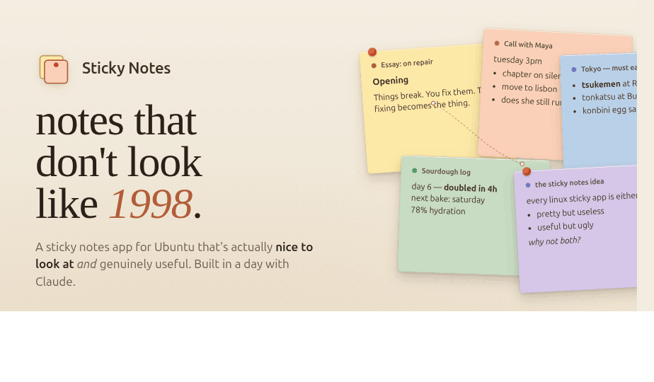
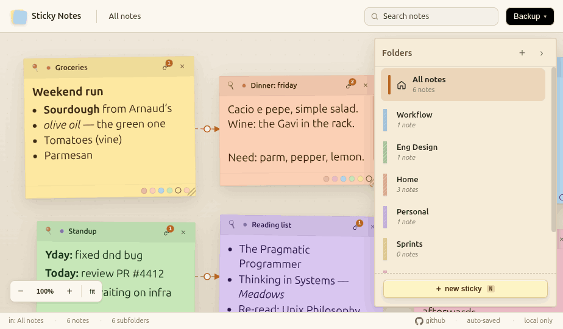
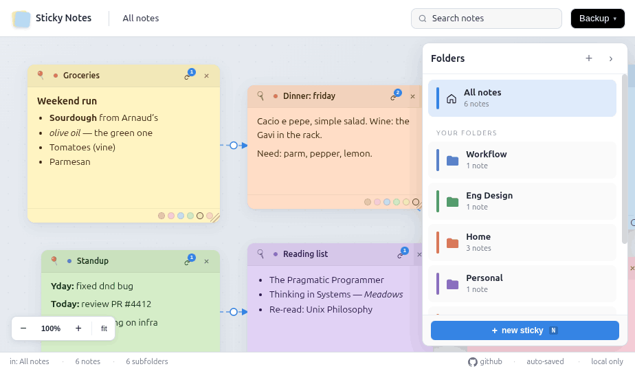
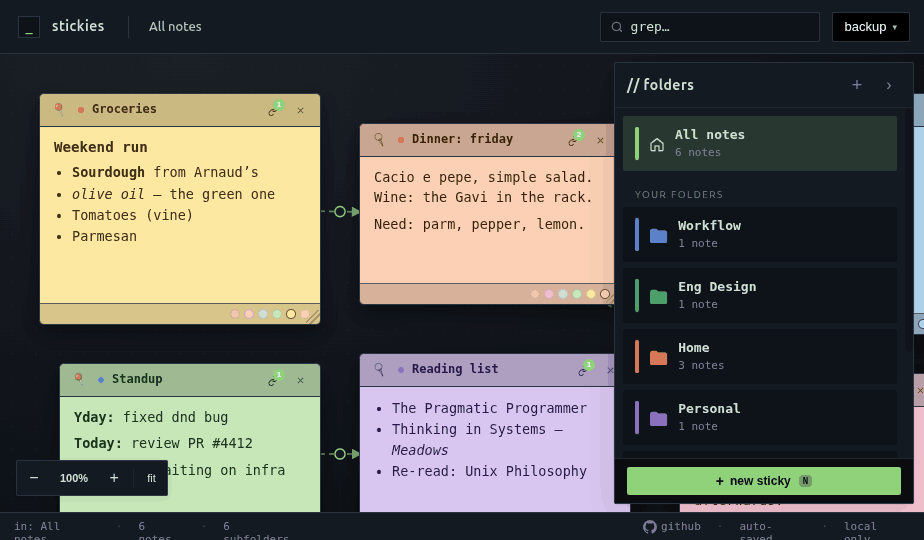
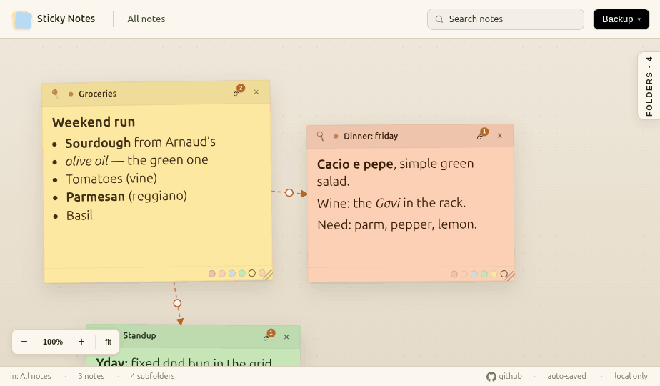

<div align="center">



# Desktop Notes

**A sticky notes app for Linux (yes, for Linux too!) and macOS that doesn't look like it escaped from a 2006 GNOME panel.**

</div>

---

## Why this exists

For ten years I've been looking for a sticky notes app for Ubuntu that I could actually stand to look at.

Every one I tried fell into one of two camps:

- **Pretty but useless.** Beautiful rounded corners, lovely typography, three features — one of which is "change the color of the note."
- **Useful but ugly.** Tabs! Folders! Tags! Wiki-links! Markdown! Rendered in fonts last updated when Firefox had a phoenix logo.

I wanted both. So this is a fork that keeps the design and adds whatever else I want.

This is that app. It runs on **Linux, macOS, and in the browser**.

---

## Screenshots

**Your whole desk, at a glance.** Pan, zoom, and drop notes wherever they feel right. Link two notes by clicking the link icon on one and then the other — connections show up as dashed arrows on the canvas.



**Folders that aren't an afterthought.** Colored folder badges, per-folder note counts, and a drawer that actually gets out of the way when you want it to.

**Three looks — because a 2pm notes session and a 2am notes session are not the same notes session.**

Paper is the default. Flat if you want something quieter. Terminal if you've made peace with what you are.

<table>
<tr>
<td></td>
<td></td>
</tr>
<tr>
<td align="center"><i>Flat</i></td>
<td align="center"><i>Terminal</i></td>
</tr>
</table>

**Close up.** Markdown body, link arrows, color-coded folder badges. Click the red pushpin in a note's header — pinned notes follow you into every folder, so the important stuff is always one click away.



---

## What it does *not* do

- Sync to the cloud. (I may add this. I also may not.)
- Collaborate in real time. These are sticky notes.
- Send you notifications. These are sticky notes.
- Parse your notes with a large language model to surface insights. **These are sticky notes.**

---

## Design principles

A short list, because the whole point of this project is that somebody should have written one:

1. **It should be pleasant to open.** If the app is ugly, I won't use it, and then none of the features matter.
2. **Features should earn their place.** Every toolbar button is a small betrayal of the reader's attention.
3. **The canvas is the interface.** Not a sidebar. Not a list. The notes, where you put them.
4. **Escape hatches everywhere.** Keyboard shortcut for the common things. Drag-and-drop for everything. Your notes are a JSON file you can read with `cat`.

---

## Install

Grab the latest from [**Releases**](https://github.com/rokokot/DesktopNotesApp/releases/latest) and pick the file for your platform:

| Platform | File | How to install |
|---|---|---|
| **Ubuntu / Debian** | `desktop-notes-app_<ver>_amd64.deb` | `sudo dpkg -i desktop-notes-app_<ver>_amd64.deb` |
| **Linux (portable)** | `Desktop Notes-<ver>.AppImage` | `chmod +x` and double-click — no install needed |
| **macOS — Apple Silicon (M-series)** | `Desktop Notes-<ver>-arm64.dmg` | mount → drag to `/Applications` |
| **macOS — Intel** | `Desktop Notes-<ver>.dmg` | mount → drag to `/Applications` |

#### Note for macOS

The macOS builds are not code-signed. If your Mac refuses to open the downloaded app, build from source instead — instructions below.

---

## Build from source

### Prerequisites

- **Node.js 20+** and **npm**
- **macOS only:** Xcode Command Line Tools — `xcode-select --install`
- **Linux only:** nothing extra; `electron-builder` fetches `fpm` (for `.deb` packaging) on first build

### Clone and install

```bash
git clone git@github.com:rokokot/DesktopNotesApp.git
cd DesktopNotesApp
npm install
```

### Build and install

#### Linux

```bash
npm run build:linux
sudo dpkg -i "dist/desktop-notes-app_$(node -p 'require(\"./package.json\").version')_amd64.deb"
```

The app appears in your Activities menu as **Desktop Notes**. To uninstall later: `sudo apt remove desktop-notes-app`.

#### macOS

```bash
npm run build:mac
cp -R "dist/mac-arm64/Desktop Notes.app" /Applications/
```

(Use `dist/mac/Desktop Notes.app` instead if you're on an Intel Mac.)

Launch from Spotlight (`Cmd+Space` → "Desktop Notes") or from Launchpad. To uninstall later, drag the app from `/Applications` to the Trash.

---

## Where your notes live

| | Path |
|---|---|
| Linux | `~/.config/desktop-notes-app/notes.json` |
| macOS | `~/Library/Application Support/desktop-notes-app/notes.json` |
| Browser | `localStorage` key `stickies.all` |

The JSON format is identical across all three — copy the file from one machine to another and your notes come with it.

---

## License

[MIT](LICENSE) — © 2026 Robin Kokot.
